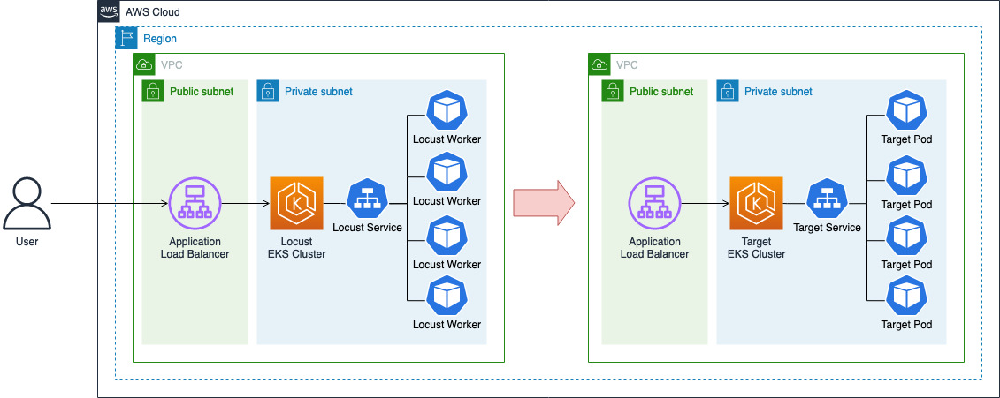
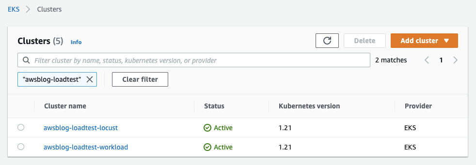
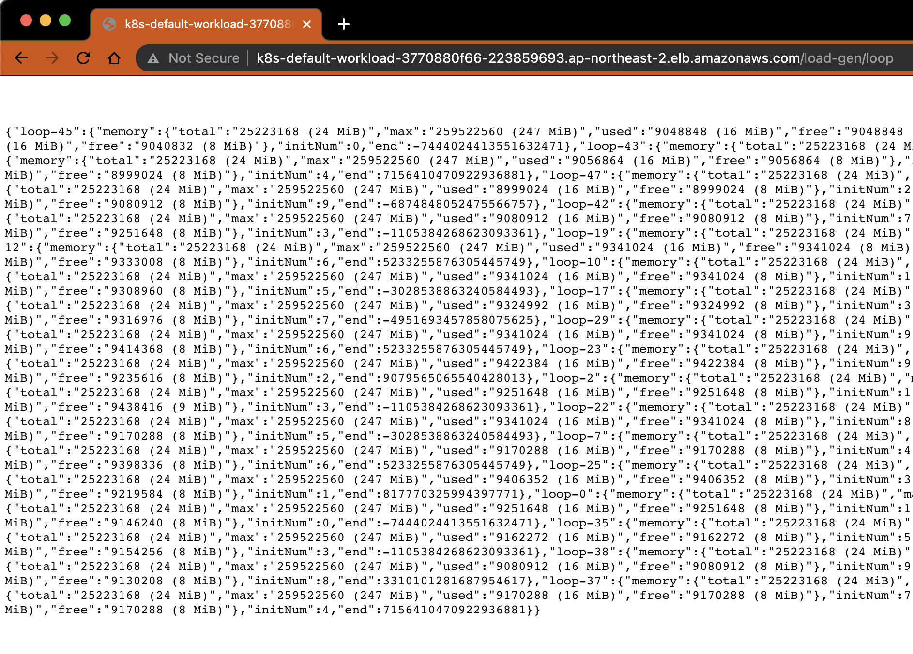

# Load testing EKS cluster with Locust

TODO: single line message to introduce this contents

## Table of content

- [Introduction](#introduction)
- [Groundwork](#groundwork)
  - [Prerequisites](#prerequisites)
  - [Provisioning EKS Clusters](#provisioning-eks-clusters)
  - [Installing Basic Addon Charts](#installing-basic-addon-charts)
  - [Installing a Sample Application Helm Chart](#installing-a-sample-application-helm-chart)
- [Walkthrough](#walkthrough)
  - [STEP 1. Install Locust](#step-1-install-locust)
    - [Switch kubernetes context to run commands on the locust cluster](#switch-kubernetes-context-to-run-commands-on-the-locust-cluster)
    - [Add Delivery Hero public chart repo](#add-delivery-hero-public-chart-repo)
    - [Write a locustfile.py](#write-a-locustfile.py)
    - [Install and Configure Locust with locustfile.py](#install-and-configure-locust-with-locustfile.py)
  - [STEP 2. Expose Locust via ALB](#step-2-expose-locust-via-alb)
  - [STEP 3. Checkout Locust Dashboard](#step-3-checkout-locust-dashboard)
  - [STEP 4. Run Test](#step-4-run-test)
- [Clean up](#clean-up)
- [Summary](#summary)
- [Security](#security)
- [License](#license)

## Introduction

More and more customers are using Elastic Kubernetes Service (EKS) to run their workload on AWS. This is why it is essential to have a process to test your EKS cluster so that you can identify weaknesses upfront and optimize your cluster before you open it to public. Load test focuses on the performance and reliability of the cluster and it is especially important for those expect high elasticity from EKS. [Locust](https://locust.io/) is one of the popular open source load testing tools that comes with a real-time dashboard and programmable test scenarios.

In this post, I walk you through the steps to build two Amazon EKS clusters, one for generating loads using [Locust](https://locust.io/) and another for running a sample workload. The concepts in this post are applicable to any situation where you want to test the performance and reliability of your Amazon [EKS cluster](https://aws.amazon.com/eks).

You can find all of the code and resources used throughout this post in [the associated GitHub repository](https://github.com/aws-samples/load-testing-eks-cluster-with-locust).

Solution background

The following diagram illustrates the architecture we use across this post. Your application is running as a group of pods in an EKS cluster (target cluster) and exposed via a public load balancer. Locust, in the meantime, is running in a separate EKS cluster (locust cluster). [Cluster Autoscaler](https://docs.aws.amazon.com/eks/latest/userguide/cluster-autoscaler.html) and [Horizontal Pod Autoscaler](https://docs.aws.amazon.com/eks/latest/userguide/horizontal-pod-autoscaler.html) will be configured on both clusters to respond to the need for scaling out in terms of the number of nodes and pods respectively.

In addition, [AWS Load Balancer Controller](https://github.com/aws/eks-charts/tree/master/stable/aws-load-balancer-controller) will be installed on both clusters to create Application Load Balancers and connect them with your Kubernetes services via [Ingress](https://kubernetes.io/docs/concepts/services-networking/ingress/).



> _**Notice.**_
>
> _All costs of our journey cannot be covered in free tier of AWS account._

## Groundwork

For our journey, we need two EKS Clusters-locust cluster is for load generator, the other is for target of workload. You can setup using below groundwork guide.

### Prerequisites

Install CLI tools and settings.

- [kubectl](https://kubernetes.io/docs/tasks/tools/#kubectl) ([check version release](https://kubernetes.io/releases/))
- [eksctl](https://eksctl.io/introduction/#installation) ([check version release](https://github.com/weaveworks/eksctl/releases))
- [helm](https://helm.sh/docs/intro/install/) ([check version release](https://github.com/helm/helm/releases))
- [jq](https://stedolan.github.io/jq/download/)
- [awscli v2](https://docs.aws.amazon.com/cli/latest/userguide/getting-started-version.html)
- [Setting AWS Profile](https://docs.aws.amazon.com/cli/latest/userguide/cli-configure-profiles.html) ([with minimum IAM policies](https://eksctl.io/usage/minimum-iam-policies/)):
  `aws sts get-caller-identity`
- Pull this repository:
  `git clone https://github.com/aws-samples/load-testing-eks-cluster-with-locust`

### Provisioning EKS Clusters

If you already have clusters, you can skip this steps.

- [Create Locust Cluster](./groundwork/eks-clusters#create-locust-cluster)
- [Create Workload Cluster](./groundwork/eks-clusters#create-workload-cluster) (option)

One thing to note is that the default VPC limit is 5 per region, so if you do not have enough resources in your environment, the above cluster creation will fail.

Then you can check the results in AWS Consoles.

- [AWS Console :: CloudFormation Stacks](https://console.aws.amazon.com/cloudformation/home#/stacks?filteringStatus=active&filteringText=awsblog-loadtest&viewNested=true&hideStacks=false)

  

- [AWS Console :: EKS Clusters](https://console.aws.amazon.com/eks/home)

  

### Installing Basic Addon Charts

For load-tesing on eks, we basically need to install these kubernetes addons charts. These charts are commonly used in eks clusters, thus we need to do the below installation jobs in both of clusters: `awsblog-loadtest-locust` and `awsblog-loadtest-workload` (or your other target cluster).

- [Deploy Metrics server (YAML)](./groundwork/install-addon-chart#deploy-metrics-server-yaml)
- [Skip installation step for HPA(Horizontal Pod Autoscaler)](./groundwork/install-addon-chart#skip-installation-step-for-hpa)
- [Install Cluster Autoscaler (Chart)](./groundwork/install-addon-chart#install-ca-helm-chart)
- [Install AWS Load Balancer Controller (Chart)](./groundwork/install-addon-chart#install-aws-load-balancer-controller-helm-chart)
- [Install Container Insights (YAML)](./groundwork/install-addon-chart#install-container-insights)

### Installing a Sample Application Helm Chart

As a last step of the groundwork, we need to deploy a sample application to be tested. We are going to use `helm` for this as well. (If you already have an application you want to test, you can skip this step and use your own application).

- [Prepare](./groundwork/install-sample-app#prepare)
- [Install Workload Application (Helm Chart)](./groundwork/install-sample-app#install-workload-application-helm-chart)

Then you can check the result like this.




Nice! It's done :)

## Walkthrough

You now have the Kubernetes side ready, but there are still a few things left to configure before we start testing your application.

### STEP 1. Install Locust

#### Switch kubernetes context to run commands on the locust cluster

TODO

#### Add Delivery Hero public chart repo

TODO

#### Write a locustfile.py

TODO

#### Install and Configure Locust with locustfile.py

TODO

### STEP 2. Expose Locust via ALB

TODO

### STEP 3. Checkout Locust Dashboard

TODO

### STEP 4. Run Test

TODO

## Clean up

When you are done with your tests, clean up all the testing resources.

```bash
# Clean Up Workload Cluster
# Switch Context to executes commands on the workload cluster
# Unset context - Optional
kubectl config unset current-context

# Set context of workload cluster
export WORKLOAD_CLUSTER_NAME="awsblog-loadtest-workload"
export WORKLOAD_CONTEXT=$(kubectl config get-contexts | grep "${WORKLOAD_CLUSTER_NAME}" | awk -F" " '{print $1}')
kubectl config use-context ${WORKLOAD_CONTEXT}

# Check if current context set to run on workload cluster
kubectl config current-context

# Uninstall Helm Charts
helm list -A |grep -v NAME |awk -F" " '{print "helm -n "$2" uninstall "$1}' |xargs -I {} sh -c '{}'

# Check Empty Helm List
helm list -A

# Delete EKS Cluster
eksctl delete cluster --name="awsblog-loadtest-workload"

# Delete ECR Repository
aws ecr delete-repository --repository-name "${ECR_REPO_NAME:-sample-application}"

# Clean Up Locust Cluster
# Switch Context to executes commands on the locust cluster
# Unset context - Optional
kubectl config unset current-context

# Set context of locust cluster
export LOCUST_CLUSTER_NAME="awsblog-loadtest-locust"
export LOCUST_CONTEXT=$(kubectl config get-contexts | grep "${LOCUST_CLUSTER_NAME}" | awk -F" " '{print $1}')
kubectl config use-context ${LOCUST_CONTEXT}

# Check if current context set to run on locust cluster
kubectl config current-context
# Uninstall Helm Charts
helm list -A |grep -v NAME |awk -F" " '{print "helm -n "$2" uninstall "$1}' |xargs -I {} sh -c '{}'

# Check Empty Helm List
helm list -A

# Delete EKS Cluster
eksctl delete cluster --name="awsblog-loadtest-locust"
```

It’s done. One things to note, don’t forget to remove **both clusters: `Locust` and `Workload`**.

## Summary

In this blog, we set up two EKS clusters and tools for load testing EKS cluster itself. With the cluster autoscaler in action, we could clearly watch high loads generated by Locust were handled smoothly as expected. Locust dashboard and Cloudwatch insight are useful to monitor maximum loads our cluster can withstand.

We can experiment further by customizing `locustfile.py` script with various testing scenarios reflecting real world use cases. In our next blog posting, we will introduce various techniques to make our EKS cluster better handle spiky high load of traffic during load testing.

TAGS: [EKS](https://aws.amazon.com/blogs/containers/tag/eks/), [Loadtest](https://aws.amazon.com/blogs/devops/tag/load-test/), [Locust](https://aws.amazon.com/blogs/devops/tag/locust/)

## Security

See [CONTRIBUTING](CONTRIBUTING.md#security-issue-notifications) for more information.

## License

This library is licensed under the MIT-0 License. See the LICENSE file.
